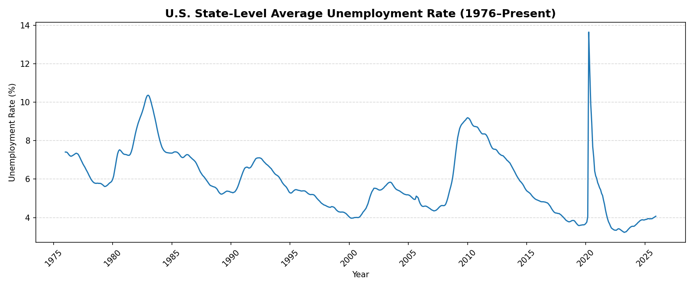
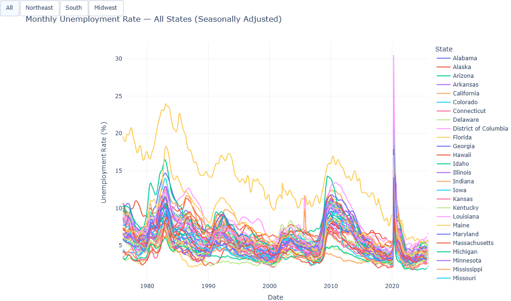
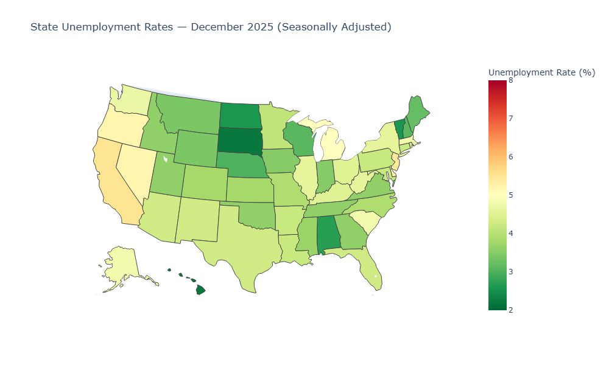
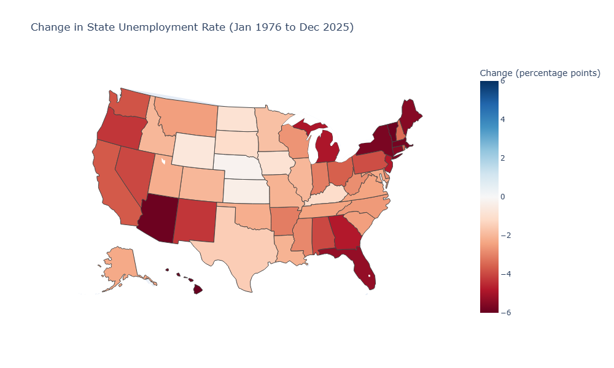
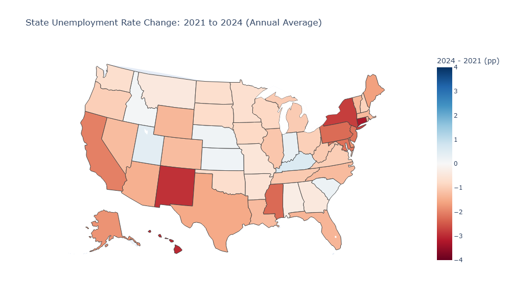
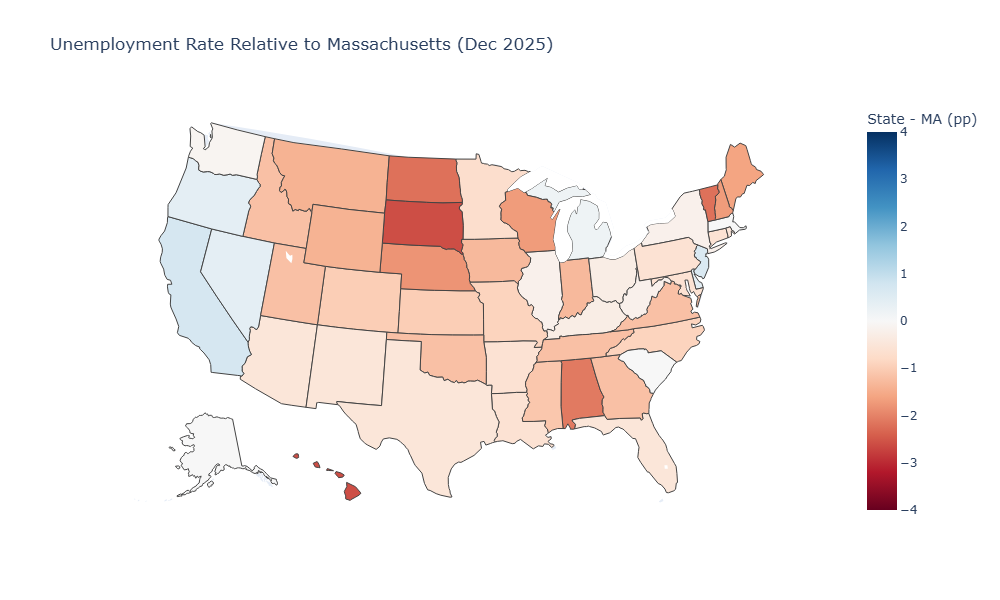
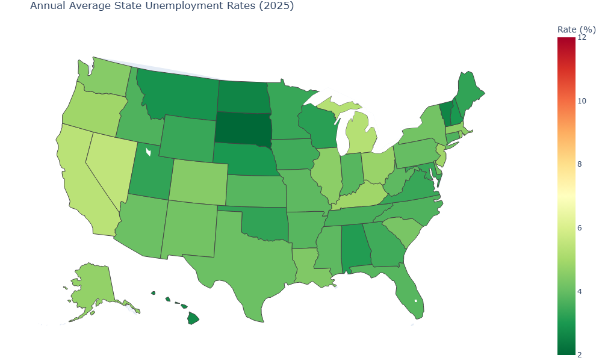

## Overview

This report examines **state-level unemployment rates** across the United States using monthly data from the Bureau of Labor Statistics (BLS). We walk through three steps:

1. **Data Collection** — where the data comes from and how it was obtained
2. **Data Cleaning** — how the raw data was reshaped and prepared for analysis
3. **Data Visualization** — a time trend chart and choropleth maps (static and interactive)

---

## 1. Data Source

| Item | Detail |
|------|--------|
| **Source** | U.S. Bureau of Labor Statistics (BLS) |
| **Program** | Local Area Unemployment Statistics (LAUS) |
| **File** | `la.data.3.AllStatesS` — Seasonally Adjusted Monthly Unemployment Rates by State |
| **URL** | https://download.bls.gov/pub/time.series/la/ |
| **Downloaded** | April 5, 2026 |
| **Coverage** | All 50 U.S. states + D.C., January 1976 – present |
| **Unit** | Unemployment rate (percent, seasonally adjusted) |

> **Note:** Seasonal adjustment removes the effect of predictable seasonal patterns (e.g., holiday hiring, summer farm labor), making month-to-month comparisons more meaningful.

### Exact Data Used In This Report

This analysis explicitly uses the following BLS file and filter:

- **Primary dataset file:** `la.data.3.AllStatesS`
- **Direct URL:** https://download.bls.gov/pub/time.series/la/la.data.3.AllStatesS
- **Local project file used:** `data/la.data.3.AllStatesS.txt`
- **Series filter applied:** `series_id` ending in `003` only
- **Meaning of measure code:** `03 = unemployment rate` (from BLS LAUS measure mapping)
- **Documentation URL:** https://download.bls.gov/pub/time.series/la/la.txt
- **Measure mapping URL:** https://download.bls.gov/pub/time.series/la/la.measure

This report does **not** use the other measure codes in the same file (e.g., `004`, `005`, `006`, `007`, `008`).

---

## 2. Data Loading

The raw file is a tab-separated text file. Each row represents one state's unemployment rate for one month.

```python
# The raw file looks like this:
# series_id                    year  period  value  footnote_codes
# LASST010000000000003          1976  M01     6.7
#
# The "series_id" encodes which state:
# - "LASST" = BLS prefix for state-level series
# - Characters 6-7 (0-indexed 5-6) = 2-digit state FIPS code (e.g., "01" = Alabama)
# - The last digit "3" = unemployment rate measure
```

```{python}
import pandas as pd

# Load the raw BLS data file
df = pd.read_csv(
    "data/la.data.3.AllStatesS.txt",
    sep="\t",         # tab-separated
    skipinitialspace=True
)

# Clean up column names (remove extra spaces)
df.columns = df.columns.str.strip()
df["series_id"] = df["series_id"].str.strip()

# Keep only unemployment rate series (code 003)
df = df[df["series_id"].str.endswith("003")].copy()

# Sanity check: fail fast if any non-003 series slips in
if not df["series_id"].str.endswith("003").all():
    raise ValueError("Non-003 series found after filtering. Stop and inspect the data pipeline.")

print(f"Using series suffix: {sorted(df['series_id'].str[-3:].unique().tolist())}")

# Preview the first 5 rows
print(f"Total rows: {len(df):,}")
df.head()
```

---

## 3. Data Cleaning

### Step 1 — Extract State FIPS Code from the Series ID

The series ID encodes which state it refers to. We extract characters at positions 5–6 to get the two-digit FIPS code.

```{python}
# Extract the 2-digit FIPS code from the series_id
df["state_fips"] = df["series_id"].str[5:7]

# How many unique states are in the data?
print(f"Unique state FIPS codes: {df['state_fips'].nunique()}")
print(df["state_fips"].unique())
```

### Step 2 — Map FIPS Codes to State Names and Abbreviations

FIPS codes are numbers assigned to each state by the federal government. We create a lookup table to convert them to readable state names.

```{python}
# Lookup table: FIPS code → state name and abbreviation
fips_to_name = {
    "01": "Alabama",        "02": "Alaska",         "04": "Arizona",
    "05": "Arkansas",       "06": "California",     "08": "Colorado",
    "09": "Connecticut",    "10": "Delaware",        "11": "District of Columbia",
    "12": "Florida",        "13": "Georgia",         "15": "Hawaii",
    "16": "Idaho",          "17": "Illinois",        "18": "Indiana",
    "19": "Iowa",           "20": "Kansas",          "21": "Kentucky",
    "22": "Louisiana",      "23": "Maine",           "24": "Maryland",
    "25": "Massachusetts",  "26": "Michigan",        "27": "Minnesota",
    "28": "Mississippi",    "29": "Missouri",        "30": "Montana",
    "31": "Nebraska",       "32": "Nevada",          "33": "New Hampshire",
    "34": "New Jersey",     "35": "New Mexico",      "36": "New York",
    "37": "North Carolina", "38": "North Dakota",    "39": "Ohio",
    "40": "Oklahoma",       "41": "Oregon",          "42": "Pennsylvania",
    "44": "Rhode Island",   "45": "South Carolina",  "46": "South Dakota",
    "47": "Tennessee",      "48": "Texas",           "49": "Utah",
    "50": "Vermont",        "51": "Virginia",        "53": "Washington",
    "54": "West Virginia",  "55": "Wisconsin",       "56": "Wyoming",
    "72": "Puerto Rico"
}

fips_to_abbr = {
    "01": "AL", "02": "AK", "04": "AZ", "05": "AR", "06": "CA", "08": "CO",
    "09": "CT", "10": "DE", "11": "DC", "12": "FL", "13": "GA", "15": "HI",
    "16": "ID", "17": "IL", "18": "IN", "19": "IA", "20": "KS", "21": "KY",
    "22": "LA", "23": "ME", "24": "MD", "25": "MA", "26": "MI", "27": "MN",
    "28": "MS", "29": "MO", "30": "MT", "31": "NE", "32": "NV", "33": "NH",
    "34": "NJ", "35": "NM", "36": "NY", "37": "NC", "38": "ND", "39": "OH",
    "40": "OK", "41": "OR", "42": "PA", "44": "RI", "45": "SC", "46": "SD",
    "47": "TN", "48": "TX", "49": "UT", "50": "VT", "51": "VA", "53": "WA",
    "54": "WV", "55": "WI", "56": "WY", "72": "PR"
}

# Add state name and abbreviation columns
df["state"] = df["state_fips"].map(fips_to_name)
df["state_abbr"] = df["state_fips"].map(fips_to_abbr)

# Drop rows where state could not be matched (e.g., unknown FIPS)
df = df.dropna(subset=["state"])

print(f"Rows after cleaning: {len(df):,}")
df[["series_id", "state_fips", "state", "state_abbr", "year", "period", "value"]].head(8)
```

### Step 3 — Parse Year and Month into a Date Column

The `period` column is formatted as `M01`, `M02`, ..., `M12`. We convert this into a proper date.

```{python}
# Convert period "M01" → month number 1
df["month"] = df["period"].str[1:].astype(int)

# Combine year and month into a single date (set to first day of each month)
df["date"] = pd.to_datetime(df[["year", "month"]].assign(day=1))

# Rename value column for clarity
df = df.rename(columns={"value": "unemployment_rate"})

# Convert to numeric — BLS files sometimes have trailing spaces or footnote codes
df["unemployment_rate"] = pd.to_numeric(df["unemployment_rate"], errors="coerce")

# Keep only the columns we need
df_clean = df[["state", "state_abbr", "state_fips", "date", "year", "month", "unemployment_rate"]].copy()

# Sort by state and date
df_clean = df_clean.sort_values(["state", "date"]).reset_index(drop=True)

print(f"Date range: {df_clean['date'].min().strftime('%B %Y')} to {df_clean['date'].max().strftime('%B %Y')}")
df_clean.head(10)
```

### Cleaning Summary

| Step | Action | Reason |
|------|--------|--------|
| Column trimming | Removed extra whitespace from column names and `series_id` | Raw BLS files have padded spaces |
| FIPS extraction | Extracted characters 5–6 from `series_id` | State identifier is embedded in the series code |
| State name mapping | Mapped 2-digit FIPS → state name and abbreviation | Raw data has no human-readable state labels |
| Date parsing | Combined `year` + `period` → proper date column | Enables time-series plotting |
| Column selection | Kept only relevant columns | Removes unnecessary metadata |

---

## 4. Visualization

### 4a — Time Trend: National Average Unemployment Rate

```{python}
import matplotlib.pyplot as plt
import matplotlib.dates as mdates
import plotly.io as pio

# Use static image renderer for reliable PDF execution
pio.renderers.default = "png"

# Calculate monthly national average (across all states)
national_avg = df_clean.groupby("date")["unemployment_rate"].mean().reset_index()
national_avg.columns = ["date", "avg_unemployment"]

# Keep only months with broad state coverage to avoid artificial spikes
state_coverage = (
    df_clean.dropna(subset=["unemployment_rate"])
    .groupby("date")["state_abbr"]
    .nunique()
    .reset_index(name="n_states")
)
valid_dates = state_coverage[state_coverage["n_states"] >= 50]["date"]
national_avg = national_avg[national_avg["date"].isin(valid_dates)].copy()

# --- Static chart using matplotlib ---
fig, ax = plt.subplots(figsize=(12, 5))

ax.plot(national_avg["date"], national_avg["avg_unemployment"],
        color="#1f77b4", linewidth=1.5, label="National Average")

ax.set_title("U.S. State-Level Average Unemployment Rate (1976–Present)",
             fontsize=14, fontweight="bold")
ax.set_xlabel("Year")
ax.set_ylabel("Unemployment Rate (%)")
ax.xaxis.set_major_locator(mdates.YearLocator(5))
ax.xaxis.set_major_formatter(mdates.DateFormatter("%Y"))
plt.xticks(rotation=45)
ax.grid(axis="y", linestyle="--", alpha=0.5)
ax.legend()

plt.tight_layout()
plt.savefig("output/national_trend.png", dpi=150)
plt.close()
```



### 4b — Time Trend: Selected States (Interactive)

```{python}
import plotly.express as px

# All states with region filter buttons
regions = {
    "Northeast": [
        "Connecticut", "Maine", "Massachusetts", "New Hampshire", "Rhode Island", "Vermont",
        "New Jersey", "New York", "Pennsylvania"
    ],
    "South": [
        "Delaware", "District of Columbia", "Florida", "Georgia", "Maryland", "North Carolina",
        "South Carolina", "Virginia", "West Virginia", "Alabama", "Kentucky", "Mississippi",
        "Tennessee", "Arkansas", "Louisiana", "Oklahoma", "Texas"
    ],
    "Midwest": [
        "Illinois", "Indiana", "Michigan", "Ohio", "Wisconsin", "Iowa", "Kansas", "Minnesota",
        "Missouri", "Nebraska", "North Dakota", "South Dakota"
    ]
}

fig = px.line(
    df_clean,
    x="date",
    y="unemployment_rate",
    color="state",
    title="Monthly Unemployment Rate — All States (Seasonally Adjusted)",
    labels={"date": "Date", "unemployment_rate": "Unemployment Rate (%)", "state": "State"},
    template="plotly_white"
)

trace_names = [trace.name for trace in fig.data]

def visible_mask(state_names):
    return [name in state_names for name in trace_names]

all_states_mask = [True] * len(trace_names)
ne_mask = visible_mask(regions["Northeast"])
south_mask = visible_mask(regions["South"])
midwest_mask = visible_mask(regions["Midwest"])

fig.update_layout(
    hovermode="x unified",
    legend_title_text="State",
    updatemenus=[
        {
            "type": "buttons",
            "direction": "right",
            "x": 0,
            "y": 1.18,
            "showactive": True,
            "buttons": [
                {"label": "All", "method": "update", "args": [{"visible": all_states_mask}]},
                {"label": "Northeast", "method": "update", "args": [{"visible": ne_mask}]},
                {"label": "South", "method": "update", "args": [{"visible": south_mask}]},
                {"label": "Midwest", "method": "update", "args": [{"visible": midwest_mask}]}
            ]
        }
    ]
)
fig.write_image("output/line_all_states.png", width=1100, height=650)
```



### 4c — Static Map: Latest State Unemployment Rate

```{python}
# Get the most recent month in the dataset
latest_date = state_coverage[state_coverage["n_states"] >= 50]["date"].max()
df_latest = df_clean[df_clean["date"] == latest_date].copy()

print(f"Mapping data for: {latest_date.strftime('%B %Y')}")

# --- Static map using matplotlib + plotly kaleido ---
fig_static = px.choropleth(
    df_latest,
    locations="state_abbr",
    locationmode="USA-states",
    color="unemployment_rate",
    scope="usa",
    color_continuous_scale="RdYlGn_r",
    range_color=[2, 8],
    title=f"State Unemployment Rates — {latest_date.strftime('%B %Y')} (Seasonally Adjusted)",
    labels={"unemployment_rate": "Unemployment Rate (%)"}
)
fig_static.update_layout(geo=dict(bgcolor="rgba(0,0,0,0)"))
fig_static.write_image("output/map_latest_static.png", width=1000, height=600)
```



### 4d — Static Map: Change from Oldest to Latest Complete Month

```{python}
# Oldest and latest complete months (>= 50 states with valid values)
first_date = state_coverage[state_coverage["n_states"] >= 50]["date"].min()
latest_date = state_coverage[state_coverage["n_states"] >= 50]["date"].max()

df_first = df_clean[df_clean["date"] == first_date][["state_abbr", "unemployment_rate"]].copy()
df_latest = df_clean[df_clean["date"] == latest_date][["state", "state_abbr", "unemployment_rate"]].copy()

df_change_long = df_latest.merge(
    df_first,
    on="state_abbr",
    how="inner",
    suffixes=("_latest", "_first")
)
df_change_long["change_pp"] = df_change_long["unemployment_rate_latest"] - df_change_long["unemployment_rate_first"]

fig_change_long = px.choropleth(
    df_change_long,
    locations="state_abbr",
    locationmode="USA-states",
    color="change_pp",
    scope="usa",
    color_continuous_scale="RdBu",
    color_continuous_midpoint=0,
    range_color=[-6, 6],
    title=f"Change in State Unemployment Rate ({first_date.strftime('%b %Y')} to {latest_date.strftime('%b %Y')})",
    labels={"change_pp": "Change (percentage points)"}
)
fig_change_long.write_image("output/map_change_oldest_to_latest.png", width=1000, height=600)
```



### 4e — Static Map: Recovery from COVID (2021 to 2024)

```{python}
# Annual average comparison: 2024 minus 2021
year_start = 2021
year_end = 2024

df_annual_recovery = (
    df_clean[df_clean["year"].isin([year_start, year_end])]
    .groupby(["state", "state_abbr", "year"])["unemployment_rate"]
    .mean()
    .reset_index()
)

rec_start = (
    df_annual_recovery[df_annual_recovery["year"] == year_start]
    [["state_abbr", "unemployment_rate"]]
    .rename(columns={"unemployment_rate": "rate_start"})
)
rec_end = (
    df_annual_recovery[df_annual_recovery["year"] == year_end]
    [["state", "state_abbr", "unemployment_rate"]]
    .rename(columns={"unemployment_rate": "rate_end"})
)

df_recovery = rec_end.merge(rec_start, on="state_abbr", how="inner")
df_recovery["change_pp"] = df_recovery["rate_end"] - df_recovery["rate_start"]

fig_recovery = px.choropleth(
    df_recovery,
    locations="state_abbr",
    locationmode="USA-states",
    color="change_pp",
    scope="usa",
    color_continuous_scale="RdBu",
    color_continuous_midpoint=0,
    range_color=[-4, 4],
    title="State Unemployment Rate Change: 2021 to 2024 (Annual Average)",
    labels={"change_pp": "2024 - 2021 (pp)"}
)
fig_recovery.write_image("output/map_change_2021_2024.png", width=1000, height=600)
```



### 4f — Static Map: Relative to Massachusetts

```{python}
# Latest complete month: difference versus Massachusetts
latest_date = state_coverage[state_coverage["n_states"] >= 50]["date"].max()
df_latest = df_clean[df_clean["date"] == latest_date].copy()

ma_rate = df_latest.loc[df_latest["state_abbr"] == "MA", "unemployment_rate"].iloc[0]
df_vs_ma = df_latest[["state", "state_abbr", "unemployment_rate"]].copy()
df_vs_ma["diff_vs_ma_pp"] = df_vs_ma["unemployment_rate"] - ma_rate

fig_vs_ma = px.choropleth(
    df_vs_ma,
    locations="state_abbr",
    locationmode="USA-states",
    color="diff_vs_ma_pp",
    scope="usa",
    color_continuous_scale="RdBu",
    color_continuous_midpoint=0,
    range_color=[-4, 4],
    title=f"Unemployment Rate Relative to Massachusetts ({latest_date.strftime('%b %Y')})",
    labels={"diff_vs_ma_pp": "State - MA (pp)"}
)
fig_vs_ma.write_image("output/map_relative_to_ma.png", width=1000, height=600)
```



### 4g — Static Map: Latest Annual Average (from annual panel)

```{python}
# Use annual averages for the slider (monthly would be too many frames)
df_annual = df_clean[df_clean["year"] >= 1990].copy()
df_annual_avg = df_annual.groupby(["state", "state_abbr", "year"])["unemployment_rate"].mean().reset_index()
df_annual_avg["unemployment_rate"] = df_annual_avg["unemployment_rate"].round(1)

fig_interactive = px.choropleth(
    df_annual_avg,
    locations="state_abbr",
    locationmode="USA-states",
    color="unemployment_rate",
    animation_frame="year",
    scope="usa",
    color_continuous_scale="RdYlGn_r",
    range_color=[2, 12],
    title="Annual Average State Unemployment Rates (1990–Present)",
    labels={"unemployment_rate": "Unemployment Rate (%)"}
)
fig_interactive.update_layout(
    geo=dict(bgcolor="rgba(0,0,0,0)"),
    coloraxis_colorbar=dict(title="Rate (%)")
)
fig_annual_latest = px.choropleth(
    df_annual_avg[df_annual_avg["year"] == df_annual_avg["year"].max()],
    locations="state_abbr",
    locationmode="USA-states",
    color="unemployment_rate",
    scope="usa",
    color_continuous_scale="RdYlGn_r",
    range_color=[2, 12],
    title=f"Annual Average State Unemployment Rates ({int(df_annual_avg['year'].max())})",
    labels={"unemployment_rate": "Unemployment Rate (%)"}
)
fig_annual_latest.update_layout(
    geo=dict(bgcolor="rgba(0,0,0,0)"),
    coloraxis_colorbar=dict(title="Rate (%)")
)
fig_annual_latest.write_image("output/map_annual_latest.png", width=1000, height=600)
```



---

## 5. Key Observations

### Where To Add Your Findings (Fill-In Section)

Use this section to summarize the main empirical findings from Figures 1–7.

#### Finding 1: National trend (Figure 1)

[Write 2-4 sentences: overall pattern, major turning points, and recent level.]

#### Finding 2: Regional/state patterns (Figures 2 and 3)

[Write 2-4 sentences: which regions/states are higher or lower, and whether dispersion across states is large or small.]

#### Finding 3: Long-run change and COVID recovery (Figures 4 and 5)

[Write 2-4 sentences: which states improved more/less, and how 2021 to 2024 compares across regions.]

#### Finding 4: Relative to Massachusetts (Figure 6)

[Write 2-4 sentences: which states are above MA, which are below MA, and what that implies for local comparison.]

#### Finding 5: Latest annual snapshot (Figure 7)

[Write 2-4 sentences: summarize the latest cross-state landscape in one paragraph.]

### Short Discussion (Interpretation)

Add a brief discussion (about 1 short paragraph each):

1. **Economic interpretation:** [What labor market mechanisms might explain these patterns?]
2. **Policy relevance:** [What does this imply for unemployment policy or wage policy discussions?]
3. **Limitations:** [What this analysis does not capture (e.g., causality, demographics, industry composition).]
4. **Next step:** [One additional dataset or model you would add in a follow-up analysis.]

### Slide-Ready Summary (3 bullets)

[Bullet 1: Main takeaway]

[Bullet 2: Evidence from maps/charts]

[Bullet 3: Caution or limitation]

---

## Appendix: Data Citation

> U.S. Bureau of Labor Statistics. (2026). *Local Area Unemployment Statistics (LAUS): Seasonally Adjusted State Unemployment Rates* [Data file]. Retrieved April 5, 2026, from https://download.bls.gov/pub/time.series/la/la.data.3.AllStatesS

> U.S. Bureau of Labor Statistics. (2026). *LAUS Documentation* [Technical documentation]. Retrieved April 5, 2026, from https://download.bls.gov/pub/time.series/la/la.txt

> U.S. Bureau of Labor Statistics. (2026). *LAUS Measure Mapping (la.measure)* [Codebook]. Retrieved April 5, 2026, from https://download.bls.gov/pub/time.series/la/la.measure
