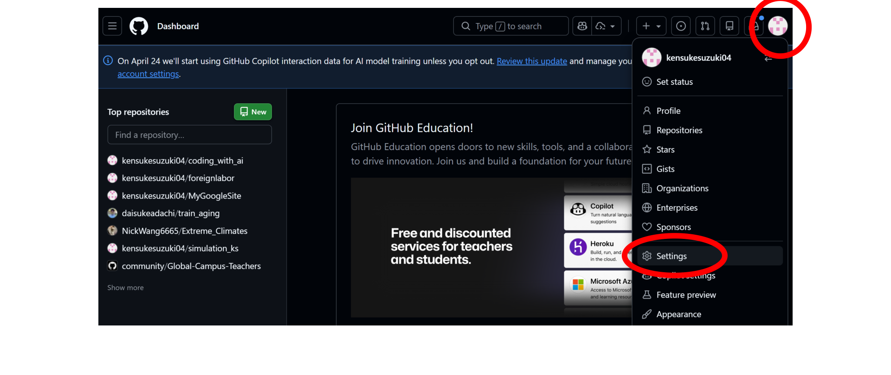
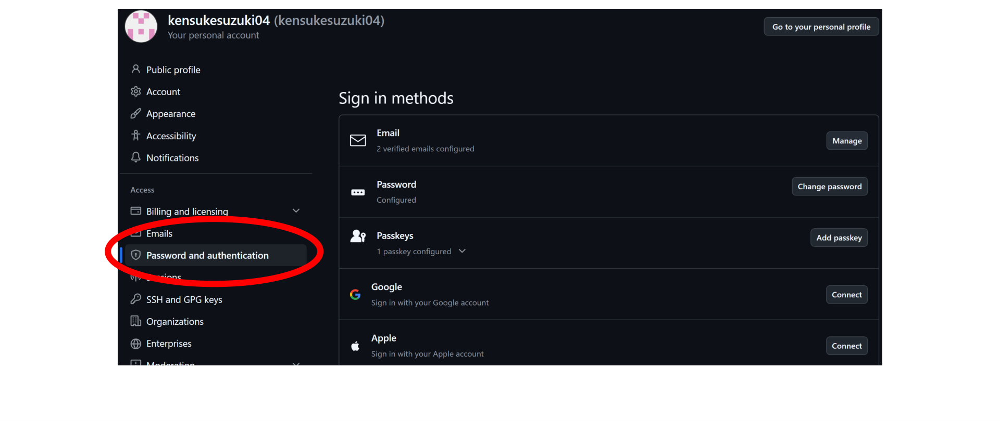
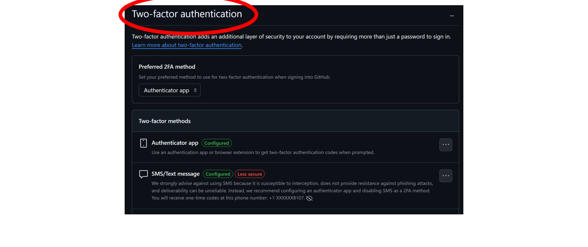
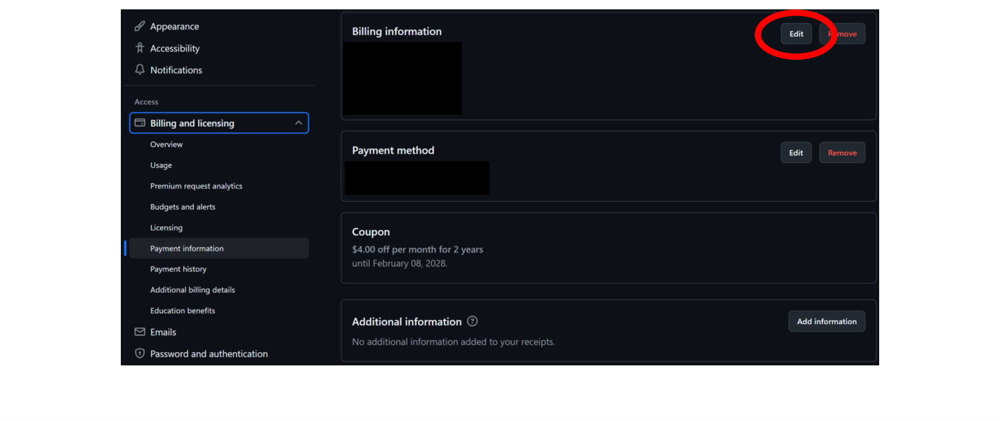
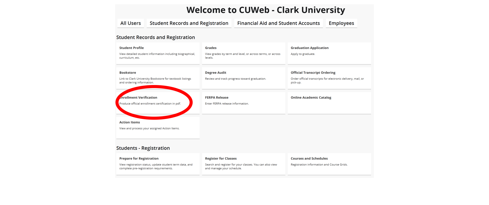
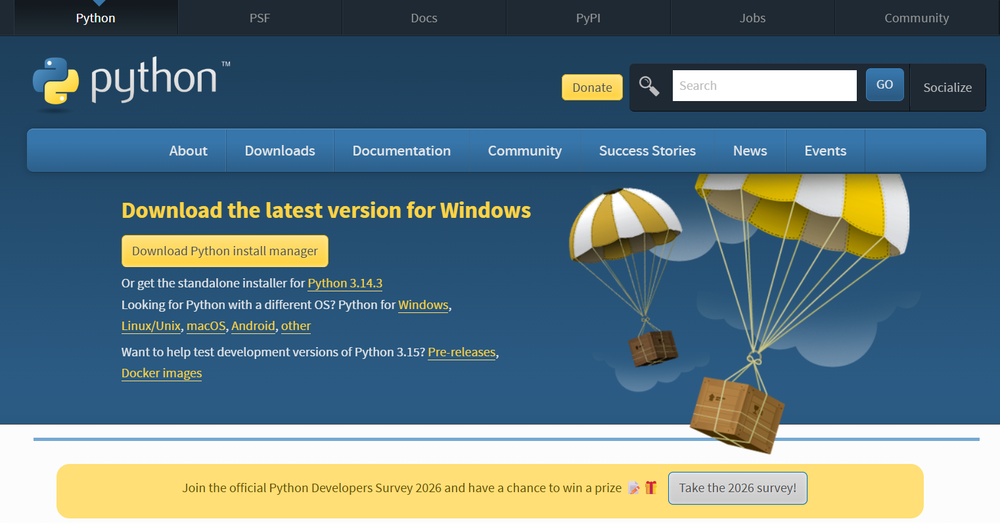
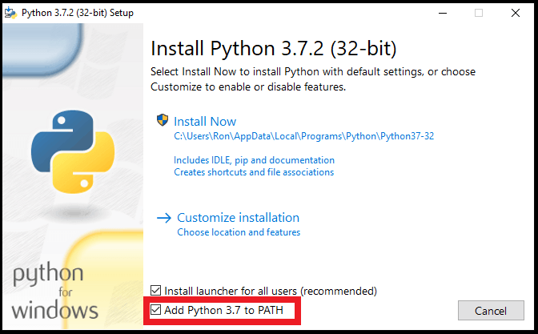
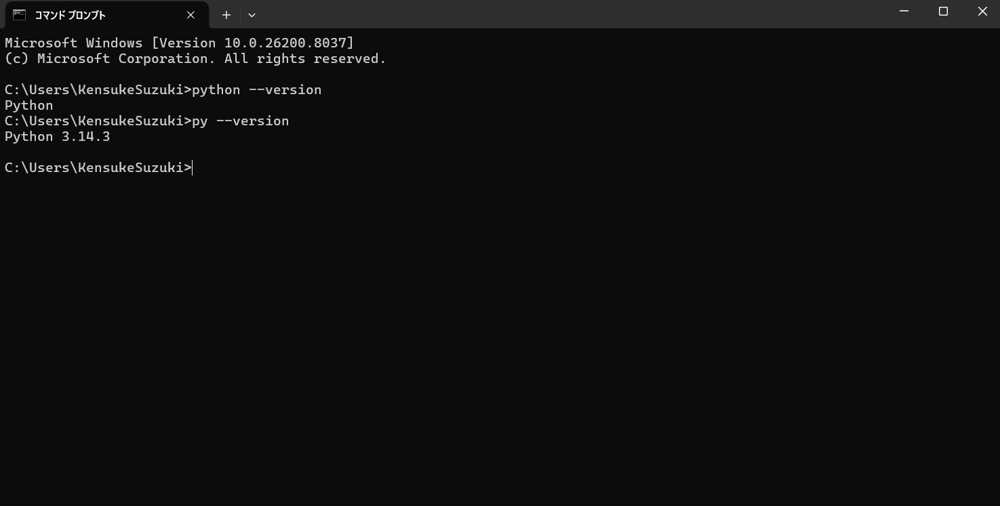
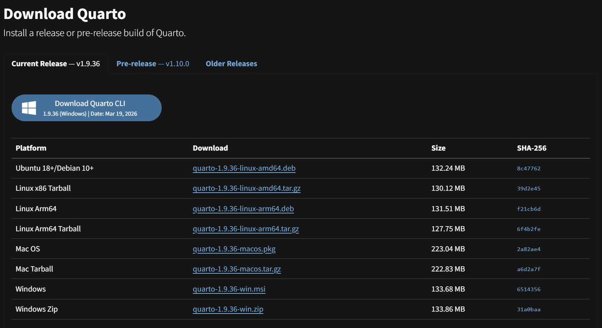

# Welcome!

## Course Information

- **Courses**: ECON206 & ECON10
- **Goal**: Set up your development environment before class
- **Focus**: Minimize setup issues during class so we can focus on coding

## What We'll Cover Today

:::: {.columns}
::: {.column width="50%"}
### Part 1: Pre-Course Setup
- GitHub & Copilot
- VS Code
- Python
- Quarto
- Extensions
:::

::: {.column width="50%"}
### Part 2: Quarto Basics
- Document structure
- Adding figures
- Creating tables
- Writing equations
- Rendering documents
:::
::::

---

# Part 1: Pre-Course Setup

## Step 1: GitHub Account & Copilot

**Do this first — verification can take a few days.**

Full step-by-step guide: [Pre-Course Preparation Guide](https://github.com/kensukesuzuki04/teaching/blob/main/econ_ai/setup_pre_course_preparation.md)

1. Create a GitHub account
2. Set up Two-Factor Authentication (2FA)
3. Fill in Billing Information (no payment required)
4. Upload your Enrollment Verification certificate as proof of enrollment

> **Tip:** Apply **on campus** (or close to campus) — GitHub uses your location for verification and approvals are faster from the Clark network.

---

## Step 1a: Create a GitHub Account

Go to **https://github.com** and click **Sign up** (top-right corner).

{width=75%}

---

## Step 1b: Set Up Two-Factor Authentication

From your GitHub Dashboard, click your **profile icon → Settings**.

{width=70%}

---

## Step 1b: Two-Factor Authentication (cont.)

In Settings, click **Password and authentication** in the left sidebar.

{width=70%}

---

## Step 1b: Two-Factor Authentication (cont.)

Enable **Two-factor authentication**. You can use the same authenticator app you use for Clark University.

{width=70%}

---

## Step 1c: Set Up Billing Information

Go to **Settings → Billing and licensing → Payment information** and click **Edit** next to Billing information.

**No payment required** — just fill in the address fields.

{width=70%}

---

## Apply for the GitHub Student Developer Pack

Go to **https://education.github.com/pack** and apply.

### What you get (free for students):
- **GitHub Copilot Pro** — AI coding assistant inside VS Code
- Access to other developer tools and credits

### What GitHub needs from you:
- A verified student email or proof of enrollment
- Your location (apply **on campus** for fastest approval)

> **Tip:** Apply while connected to the Clark University network — approvals are much faster.

---

## Step 1d: Get Enrollment Verification

Log in to **https://cuweb.clarku.edu**. Under **Student Records and Registration**, click **Enrollment Verification**.

{width=70%}

---

## Step 1d: Take a Screenshot

CUWeb displays your **Current Enrollment Verification Certificate**. Take a screenshot and upload it when GitHub asks for proof of enrollment.

{width=70%}

> **Students who used Enrollment Verification reported immediate approval!**

---

# Software Installation

## Recommended Folder Structure

Create this folder before you start. **All your files go inside it.**

:::: {.columns}
::: {.column width="45%"}
**For setup/testing:**
```
Documents/
  └── Economics/
      └── setup_test/
          ├── test.py
          └── test.qmd
```
:::

::: {.column width="55%"}
**For ongoing coursework:**
```
Documents/
  └── Economics/
      ├── setup_test/
      ├── econ206/
      │   └── (your work here)
      └── econ10/
          └── (your work here)
```
:::
::::

- Avoid spaces in folder/file names (use `_` instead)
- Keep a clear hierarchy: General → Subject → Project

---

## Always Start with "Open Folder" in VS Code

**Before creating or saving any file, every single time:**

1. Go to **File → Open Folder**
2. Select your course folder (e.g., `Economics/setup_test/`)
3. Create and save all files **inside that folder**

> ⚠️ **Common mistake:** Some students saved files outside the working directory — on the Desktop, in Downloads, or in a random location. When this happens, VS Code cannot find your other files and code will not run correctly.

| ❌ Don't do this | ✓ Do this |
|---|---|
| Open a `.py` file directly | Open the **folder** first |
| Save to Desktop or Downloads | Save inside your course folder |
| Drag a file into VS Code | Use File → Open Folder |

---

## Step 2: Install Visual Studio Code

Download: **https://code.visualstudio.com/download**

:::: {.columns}
::: {.column width="50%"}
### Installation Tips (Windows):

- Enable **"Add to PATH"**
- Enable "Open with Code"
- Register Code as an editor for supported file types
:::

::: {.column width="50%"}
{width=100%}
:::
::::

---

## Step 2: Test VS Code

1. Open VS Code
2. Go to **File > Open Folder** and select your `setup_test` folder
3. Create a new file (e.g., `hello.txt`) and type something
4. If VS Code opens and the file saves without errors, it's working ✓

---

## Step 2: Install VS Code Extensions

Click the **Extensions** icon on the left sidebar and install:

1. **Python** by Microsoft
2. **Jupyter** by Microsoft
3. **Quarto** by Quarto
4. **GitHub Copilot** by GitHub

---

## Step 3: Install Python — Download

:::: {.columns}
::: {.column width="50%"}
Go to **https://www.python.org/downloads/**

- **Windows**: click *"Or get the standalone installer for Python 3.14.3"* to download a `.exe` file
- **Mac**: click *"Download Python 3.14.3"* to download a `.pkg` file
:::

::: {.column width="50%"}
{width=100%}
:::
::::

---

## Step 3: Install Python — PATH Checkbox (Windows)

:::: {.columns}
::: {.column width="50%"}
### Key Step (Windows only):
**✓ Check "Add Python to PATH"** before clicking Install Now

On Mac, the installer sets PATH automatically — no checkbox needed.
:::

::: {.column width="50%"}
{width=100%}
:::
::::

---

## Opening the Terminal {.smaller}

:::: {.columns}
::: {.column width="50%"}
**Windows — Command Prompt:**

1. Click the **Start menu**
2. Type `cmd`
3. Open **Command Prompt**

**Mac — Terminal:**

1. Press **`⌘ Command + Space`** to open Spotlight
2. Type `Terminal`
3. Click **Terminal** in the results
:::

::: {.column width="50%"}
{width=100%}
:::
::::

---

## Step 3: Test Python

:::: {.columns}
::: {.column width="55%"}
**Windows** — in Command Prompt or VS Code terminal:
```bash
python --version
# or
py --version
```

**Mac** — in Terminal or VS Code terminal:
```bash
python3 --version
```

> **Mac tip:** Always use `python3`, not `python` — on Mac, `python` may not work or point to an old version.

**Expected**: `Python 3.14.3` ✓
:::

::: {.column width="45%"}
{width=100%}
:::
::::

---

## Step 3b: Run Python in VS Code

:::: {.columns}
::: {.column width="55%"}
1. In VS Code: **Terminal > New Terminal**
2. Create `test.py`:

```python
print("Python is working")
```

3. Run:

   Windows: `python test.py` (or `py test.py`)

   Mac: `python3 test.py`

**Expected**: `Python is working` ✓
:::

::: {.column width="45%"}
{width=100%}
:::
::::

---

## Step 4: Install Quarto — Download

:::: {.columns}
::: {.column width="50%"}
Go to **https://quarto.org/docs/get-started/**

- Use the **current release v1.9.36** (not the pre-release)
- **Windows**: download the `.msi` file
- **Mac**: download the `.pkg` file

Run the installer and finish installation.
:::

::: {.column width="50%"}
{width=100%  fig-alt="Quarto download page"}
:::
::::

---

## Step 4: Test Quarto

Open the VS Code terminal (**Terminal > New Terminal**) and run:

```bash
quarto --version
```

**Expected output**: `1.9.36` ✓

If you see `command not found`, try restarting VS Code or your computer.

---

## Step 5: Install PDF Engine for Quarto

### Recommended: TinyTeX (simplest option)

Run this in your terminal:

```bash
quarto install tinytex
```

> Quarto handles the download automatically. This may take a few minutes — that is normal.

### Alternatives (if TinyTeX fails):
TeX Live · MiKTeX

---

## Step 5: What Does That Command Mean?

| Part | What it does |
|---|---|
| `quarto` | Calls the Quarto program you installed in Step 4 |
| `install` | Tells Quarto to download and install something |
| `tinytex` | A lightweight LaTeX engine — needed to create PDF files |

You do not need to visit any other website. Quarto installs TinyTeX for you automatically.

---

## Step 5b: Test Quarto PDF Rendering

In your `setup_test` folder, create `test.qmd`:

```markdown
---
title: "Quarto PDF Test"
format: pdf
---

# Test

If you can read this in a PDF file,
Quarto and the PDF engine are working.
```

Run:
```bash
quarto render test.qmd --to pdf
```

**Expected**: A new file `test.pdf` appears ✓

---

# Verify & Finalize

## Step 6: Confirm Everything Works

:::: {.columns}
::: {.column width="50%"}
### Installation
- ✓ VS Code opens normally
- ✓ Python runs in terminal (`python --version`)
- ✓ Quarto runs in terminal (`quarto --version`)
- ✓ GitHub account ready for VS Code sign-in
:::

::: {.column width="50%"}
### Extensions & Tests
- ✓ Python extension installed
- ✓ Jupyter extension installed
- ✓ Quarto extension installed
- ✓ `test.py` runs successfully
- ✓ `test.qmd` renders to PDF
:::
::::

---

## What NOT to Install

- ❌ Project-specific Python packages yet
- ❌ Virtual environments yet
- ❌ Additional data science tools yet

**We'll do all of this in class!**

---

# Part 2: Quarto Basics

## What is Quarto?

Quarto is a document publishing system that lets you:

- Write in Markdown
- Include code and equations
- Generate HTML, PDF, Word, slides, websites
- Mix text, figures, tables, and code output

---

## Key Concept: Working Directory

### Simple Rule:

Keep your files organized in one folder:

```
my_project/
  ├── draft.qmd
  ├── figure1.png
  ├── table1.csv
  └── data/
      └── sample.xlsx
```

**When you run `quarto render draft.qmd`, Quarto looks for files relative to this folder**

---

## General Template

```markdown
---
title: "Draft Title"
author: "Your Name"
date: today
format:
  html: default
  pdf: default
---

# Introduction

Write 2-3 sentences about the purpose.

# Content Section

Your content goes here.
```

---

## How to Add Figures

### Same folder as your .qmd file:
```markdown

```

### In a subfolder:
```markdown

```

⚠️ **Common error**: Wrong file path or typo in filename

---

## How to Make Tables: Option A

### Simple Markdown table

```markdown
| Item | Amount |
|---|---:|
| Apples | 12 |
| Oranges | 8 |
```

Renders as:

| Item | Amount |
|---|---:|
| Apples | 12 |
| Oranges | 8 |

---

## How to Make Tables: Option B

### Convert from Excel to CSV

1. Save your Excel file as CSV
2. Use an online converter to generate Markdown:
   - TableConvert: https://tableconvert.com/excel-to-markdown
   - TablesGenerator: https://www.tablesgenerator.com/markdown_tables
3. Paste the output into your `.qmd` file

---

## How to Include Hyperlinks

### External links:
```markdown
[Quarto Documentation](https://quarto.org/docs/)
```

### Local files:
```markdown
[See the setup guide](setup_pre_course_preparation.md)
```

---

## How to Write Equations

### Inline equations (with `$...$`):

```markdown
The demand function is $Q_d = a - bP$.
```

Renders as: The demand function is $Q_d = a - bP$.

---

## Display Equations

### Block equations (with `$$...$$`):

```markdown
$$
GDP = C + I + G + NX
$$
```

### More examples:

```markdown
$\frac{a}{b}$        # Fractions

$\sum_{i=1}^{n}$    # Summation

$\alpha, \beta, \gamma$  # Greek letters
```

---

## LaTeX Math Resources

- **Overleaf**: https://www.overleaf.com/learn/latex/Mathematical_expressions
- **Detexify**: https://detexify.kirelabs.org/classify.html (draw a symbol to find its code)
- **Wikibook**: https://en.wikibooks.org/wiki/LaTeX/Mathematics

---

## How to Render Your Document

### Basic render (HTML):
```bash
quarto render draft.qmd
```

### Render to PDF:
```bash
quarto render draft.qmd --to pdf
```

### Render to Word:
```bash
quarto render draft.qmd --to docx
```

⚠️ **PDF error?** Check your PDF engine installation

---

# You're Ready! 🎉

## Next Steps:

1. **Before Class**: Complete all installation steps
2. **Verify**: Run the test files to confirm everything works
3. **In Class**: We'll build on this foundation together

## Questions?

Feel free to reach out if you encounter any issues during setup!

---

## Additional Resources

- [Quarto Official Documentation](https://quarto.org/docs/)
- [VS Code Documentation](https://code.visualstudio.com/docs/)
- [Python Official Documentation](https://www.python.org/doc/)
- [GitHub Copilot Help](https://github.com/features/copilot)
